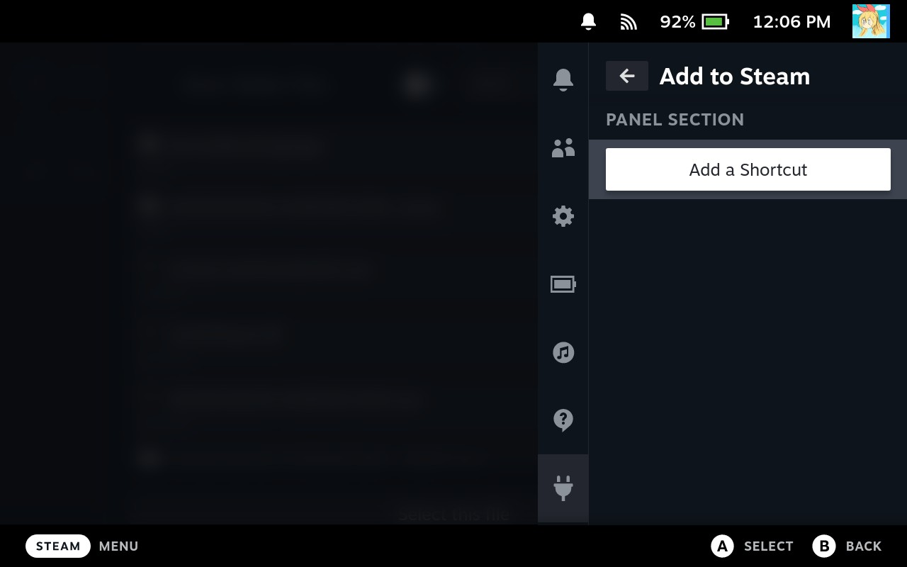

].versions[0].name&url=https%3A%2F%2Fplugins.deckbrew.xyz%2Fplugins)
## Decky-AddToSteam Plugin
A simple plugin to add Steam shortcuts to files from GameMode.

## Overview
This plugin provides a simple file-picker to select any file and add a Steam shortcut directly to the file. Currently it doesn't do anything special beyond that.

## Installation
~~#### Decky-Loader Store~~
~~1. [Install decky-loader](https://github.com/SteamDeckHomebrew/decky-loader#installation)~~
~~2. Use the built in plugin store to download the Add to Steam plugin~~
#### Manual Installation
1. Start the deck in Gaming Mode
2. Open Decky-Loader in the QAM
3. Go to Decky settings
4. Scroll down the `General` settings to `Other`
5. Enable `Developer mode`
6. Go to the `Developer` settings
7. Go to the `Install Plugin from URL` URL option
8. Press A to bring up the virtual keyboard, or use your own keyboard to add the following url:
   - `https://github.com/jurassicplayer/decky-addtosteam/releases/latest/download/decky-addtosteam.zip`
9. Press `Install` and `Confirm`

## Usage
- Press the `Add a Shortcut` button to open a file picker
- Navigate to the folder and select the file you would like to create a shortcut to
- Check toast to verify shortcut has successfully been made

## Functionality
- Upon selecting a file, the Add to Steam plugin will attempt to add a steam shortcut up to 5 times before giving up on a single file selection.
   - This is a workaround for SteamOS internal AddShortcut function which seems to be inconsistent at adding shortcuts correctly.
- Any invalid shortcut attempts will be removed before notifying the user of the end result.

## Ran Into an Issue?
- In order to properly assess what could potentially be happening, you must be able to reproduce the issue or provide steps for me to attempt reproducing the issue. In the event that you are able to repeatedly reproduce the issue, please follow the following steps and submit the logs so I can fix it for you :D (that's the hope anyways).

#### Obtaining debugging information
- Reset your device
- Ensure that your device and a computer are connected on the same network
- Go to the Decky settings and enable `Allow Remote CEF Debugging`
- From the computer, navigate to `http://<steamdeck-ip>:8081` using a google chrome/chromium-based browser
- On the list of links, click `Steam`
- Click on the `Console` tab
- Set the `Log Level` dropdown (to the right of the `Filter` box) to include `Verbose`
- Reproduce the issue on your device
- Right click on the log and choose `Save as...` OR make screenshots beginning from the line: `Trying to load Add to Steam`
- Upload the file/screenshots to a new/relevant [Github issue](https://github.com/jurassicplayer/decky-addtosteam/issues)

## Notes
- While far more asthetically pleasing, I currently don't have any ideas on how to inject a shortcut into SteamOS that can be used to bring up the file picker externally.

## Future Plans
- Maybe come up with a better way to open the file picker prompt
- If there is a way to set
- Bugfixes

## Thanks
- [@Tormak9970](https://github.com/Tormak9970)
- All the other plugin devs (without their plugins as examples, I wouldn't have known what I was doing)
